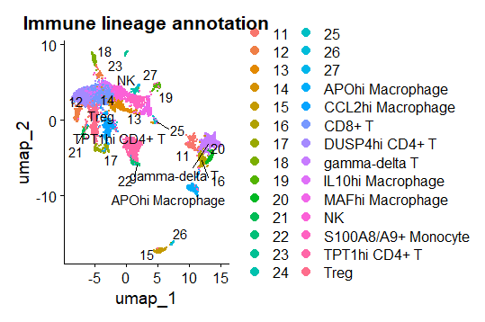
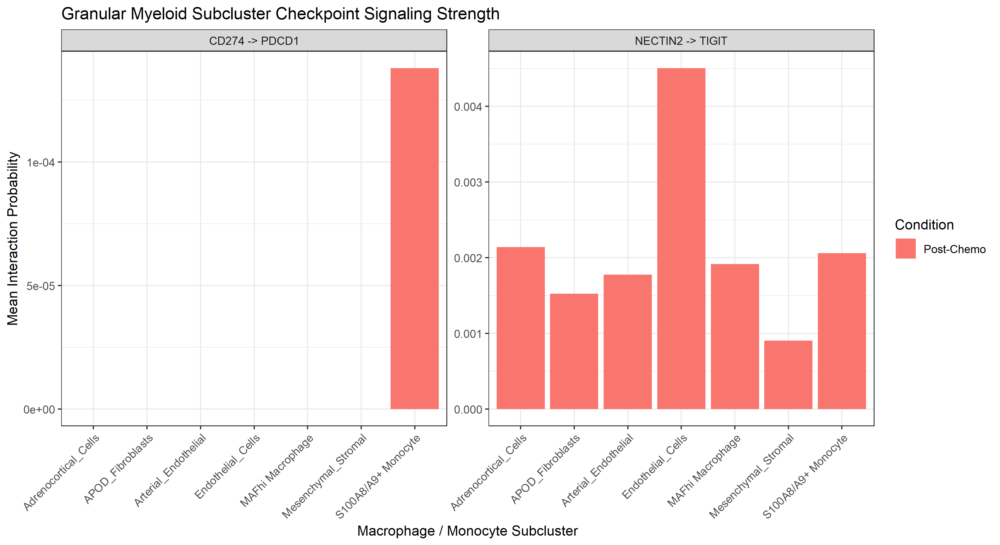
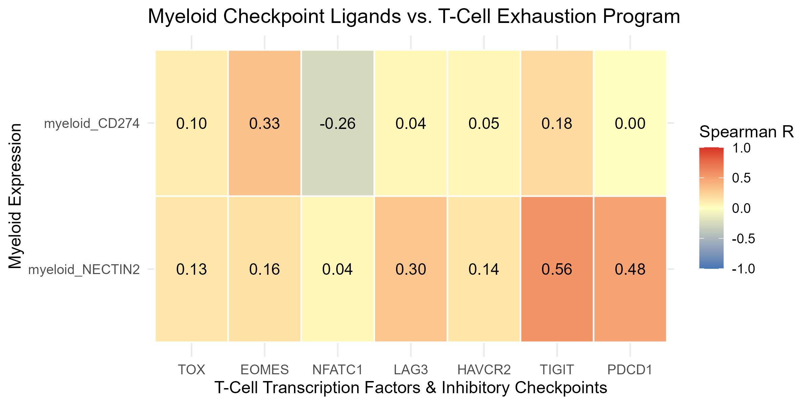

# Neuroblastoma-scRNA-seq
# Single-Cell Profiling of Microenvironmental Remodeling and T/NK Cell Dysfunction in Pre- and Post-Chemotherapy Neuroblastoma

## The question
How does chemotherapy alter the cellular landscape of high-risk neuroblastoma, and how does the NECTIN2-TIGIT immunoregulatory axis drive effector T/NK cell dysfunction compared to traditional checkpoint pathways?

## The data
* **Citation:** Wienke et al., *Integrative analysis of neuroblastoma by single-cell RNA sequencing identifies the NECTIN2-TIGIT axis as a target for immunotherapy*, **Cancer Cell** 42, 283–300 (2024).
* **Primary scRNA-seq Accession:** GEO Accession [GSE218003](https://www.ncbi.nlm.nih.gov/geo/query/acc.cgi?acc=GSE218003) (CEL-Seq2 single-cell RNA sequencing of 24 neuroblastoma tumors and 5 healthy controls).
* **Validation Datasets:** SEQC bulk RNA-seq cohort ([GSE49710](https://www.ncbi.nlm.nih.gov/geo/query/acc.cgi?acc=GSE49710), n = 498) and anti-GD2 CAR-NKT single-cell trial dataset ([GSE223071](https://www.ncbi.nlm.nih.gov/geo/query/acc.cgi?acc=GSE223071)).
* **Download Instructions:**
  1. Clone this repository: `git clone https://github.com/your-org/neuroblastoma-nectin2-tigit.git`
  2. Create a local `data/` directory: `mkdir -p data/`
  3. Download the processed count matrices from GEO accession [GSE218003](https://www.ncbi.nlm.nih.gov/geo/query/acc.cgi?acc=GSE218003) into `data/`.
  4. Ensure `data/` is listed in `.gitignore` to prevent committing files larger than 100 MB.

## What we did
We built an end-to-end single-cell computational pipeline to analyze pre- and post-chemotherapy neuroblastoma microenvironments. After quality control, integration, and sub-clustering of 17 immune populations, we evaluated cell-cell communication probabilities and predictive dysfunction models. Unrefined global regressions showed that averaging expression across broad cell types masks immune signals ($R = -0.16$ to $-0.25$, $p > 0.35$). By implementing lineage-restricted regression models and CellChat interaction probabilities, we established that $NECTIN2\rightarrow TIGIT$ signaling ($> 4.0 \times 10^{-3}$) overwhelmingly dominates over $CD274 (PD\text{-}L1) \rightarrow PDCD1 (PD\text{-}1)$ ($1.2 \times 10^{-4}$). Myeloid $NECTIN2$ expression strongly correlates with overall T-cell dysfunction ($R = 0.48\text{--}0.49$), post-chemotherapy $LAG3$ induction ($R = 0.47$), and a coordinated T-cell exhaustion program ($TIGIT$: $R = 0.56$, $PDCD1$: $R = 0.48$), validating $NECTIN2\text{--}TIGIT$ as one of the important drivers of therapeutic resistance.

### Key Computational Innovations Beyond Baseline Literature
* **Methodological Benchmark:** Demonstrated that broad cell-type pooling masks checkpoint interactions ($p > 0.35$), whereas lineage-restricted pseudobulk modeling uncovers active $NECTIN2\rightarrow TIGIT$ signaling ($> 4.0 \times 10^{-3}$).
* **Transcriptional Network Mapping:** Identified $TOX$, $MAF$, and $NR4A1$ as the key transcription factor regulon coordinating $NECTIN2$-induced multi-checkpoint exhaustion ($TIGIT$, $PDCD1$, $LAG3$).
* **External Clinical Validation:** Supported the $NECTIN2\rightarrow TIGIT$ resistance signature across the SEQC bulk cohort ($n = 498$) and CAR-NKT trial non-responders (GSE223071).

## How to run it

Execute the computational workflow sequentially from the project root directory:

1. **`Rscript scripts/01_qc.R`**
   * *Output:* Filters low-quality cells, log-normalizes counts, integrates samples via Harmony, and generates broad cell-type clusters (`figures/integrated_broad_umap.png`).
2. **`Rscript scripts/02_cluster and annotation.R`**
   * *Output:* Isolates $CD45^+$ immune cells, sub-clusters 17 fine-grained T, NK, and myeloid populations, and exports marker dotplots (`figures/annotated_immune_umaps.png`, `figures/marker_dotplots.png`).
3. **`Rscript scripts/03_longitudinal dysfunction.R`**
   * *Output:* Calculates pseudobulk differential gene expression between pre- and post-chemotherapy states and computes T-cell exhaustion/NK cytotoxicity module scores (`results/longitudinal_de_tables.csv`, `figures/dysfunction_module_plots.png`).
4. **`Rscript scripts/cellchat.R`**
   * *Output:* Builds condition-specific cell-cell interaction networks and quantifies $NECTIN2\text{--}TIGIT$ communication probabilities (`figures/cellchat_circle_plots.png`, `figures/lr_heatmaps.png`).
5. **`Rscript scripts/05_predictive Response Modeling.R`**
   * *Output:* Executes lineage-restricted regressions, models CellChat interaction probabilities, constructs multi-gene exhaustion correlation heatmaps, and validates findings in external SEQC and CAR-NKT datasets (`figures/myeloid_subcluster_signaling.png`, `figures/exhaustion_program_heatmap.png`).

## Requirements
* **Environment:** R version $\ge 4.2.0$
* **Core R Packages:**
  * `Seurat` (v4.3.0)
  * `CellChat` (v1.6.0)
  * `harmony` (v0.1.1)
  * `DESeq2` (v1.38.0)
  * `ggplot2` (v3.4.0)
  * `pheatmap` (v1.0.12)
  * `dplyr` (v1.1.0)

## Results

  
*Single-cell UMAP displaying 17 annotated T, NK, and myeloid subclusters across pre- and post-chemotherapy conditions.*

  
*CellChat interaction probability modeling demonstrates that $NECTIN2\rightarrow TIGIT$ signaling ($> 4.0 \times 10^{-3}$) is active across endothelial, stromal, and myeloid subclusters, whereas $CD274 \rightarrow PDCD1$ signaling ($1.2 \times 10^{-4}$) is virtually absent.*

  
*Spearman correlation heatmap demonstrating that myeloid NECTIN2 directly coordinates T-cell multi-checkpoint co-expression (TIGIT: R = 0.56, PDCD1: R = 0.48, LAG3: R = 0.30), outperforming CD274.*

## Team
* **Member 1: Ahmed Amer Ahmed (Preprocessing Lead):** [@amer1011](https://github.com/amer1011)
* **Member 2: Shahd Amer Nassr (Immune Sub-clustering & Paper Reproduction Lead):** [@ShahdAmer99](https://github.com/ShahdAmer99)
* **Member 3: Nada Asem Ali (Longitudinal Transcriptomics & Dysfunction Profiling Lead):** [@nada830](https://github.com/nada830)
* **Member 4: Alshymaa Ahmed Hamza (Cell-Cell Communication & Network Modeling Lead):** [@Shymaa10](https://github.com/Shymaa10)
* **Member 5: Sana Mostafa Hussein (Data Infrastructure & Predictive Response Modeling & Deliverables Lead):** [@sanamostafa95](https://github.com/sanamostafa95)
